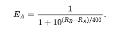
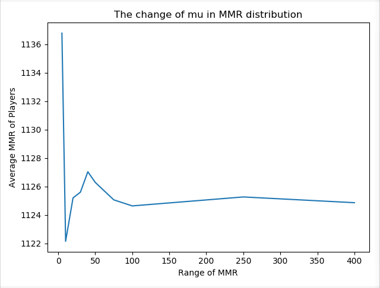
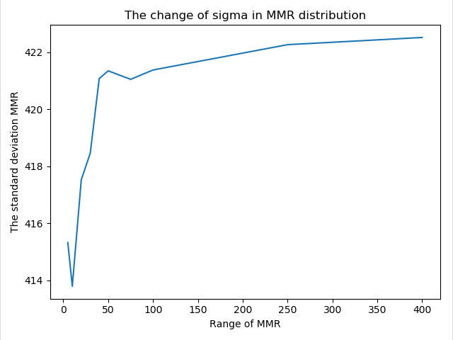
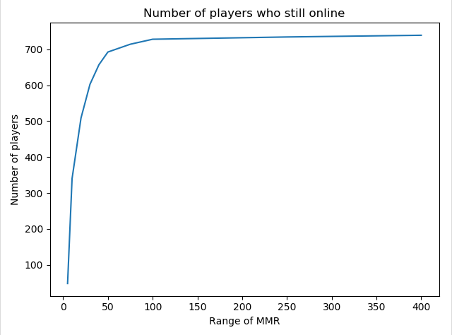
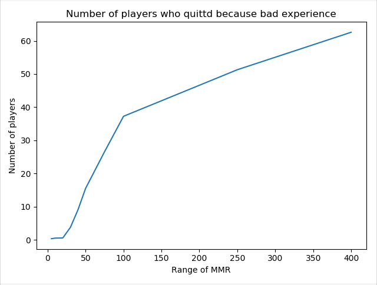
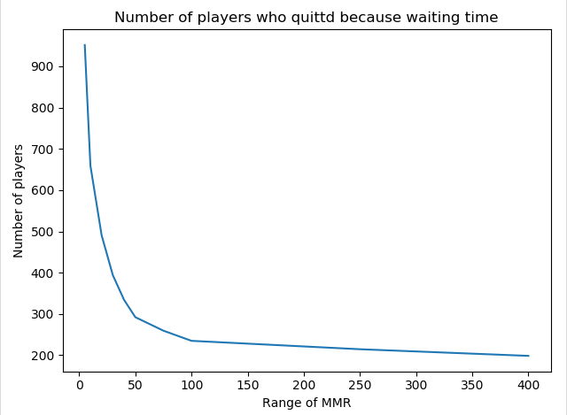

# Monte Carlo Simulation on Game Matchmaking

### Team members: Han Wang, Jiani Shi

## Summary

In multiplayer video games, matchmaking is the process of connecting players together for online play sessions. The design of matchmaking has significant impact on playing experience of players.

To match players of roughly equal ability together, Matchmaking Rating (MMR) is introduced as a value that determines the skill level of each player.

It also offers a special internal rating system used for matchmaking, in which system would choose players with similar MMRs to compose a match. 

The MMR score is calculated by the Elo rating system, which is widely used in master-level chess game and many video games such as Hearthstone. Below is the basic formula:

After a match, this formula would generate the new MMRs.

## Assumption and Hypothesis
If the difference of MMRs in a match is too large, there is a significant probability that players on both sides would have a terrible or boring playing experience.

If the difference is too small, the waiting time of matchmaking would be too long, which also negatively affect the playing experience.

In this project, we focus on finding an appropriate MMR range rule for matchmaking to allow players to have best playing experience. To analyze that, we find the changes of MMR distribution under different rules and the number of players that are still willing to stay in the match pool. If the MMR range is proper, the distribution of MMR will not be changed too much after multiple times tests. Besides, the better MMR range is, more people would stay.

## Introduction of Methods

- __Create online players__
We suppose that in an online game, the level distribution of players follows a normal distribution. Thus, we generate 1000 players who are reprensented by their MMR rating. The range of MMR in this "game" is [0,3000]. The mu of normal distribution is 1125 and the sigma is 425, which is a wellknown distribution from famous game *DOTA2.

- __Create enter time for players__
We suppose that all the players will login and join the match pool within 10 minutes which follows a uniform distribution. Thus, a uniform distribution U[0,600] is used to represented the second that a player join the match pool.

- __Create dataframe__
We save the information of players to a dataframe and sort it by enter time. It contains the MMR, enter time, how long they have waited for a match, the times of matches they took, the online/offline status, the average waiting time for a match.

- __If a match begin__
The time of a match is set as 60 seconds. After a match, the MMR of two players will be updated based on the result (use another function to determine the result).

- __If waiting time is too long__
Players whose average waiting time are higher than 60 seconds will quit the game at 10% after each matchmaking.

- __Compare MMR__
If the difference of MMR of two players is too high, the loser will probably quit the game.

- __Compute win or lose__
Use Elo equotation to compute the expected winning rate. Use a random number to represent to result.

- __Matchmaking__
Use a counter to count the time has passed and let the players whose enter time are lower than counter enter the match pool. Then create a small dataframe and sort it by MMR. We make the match every 5 seconds. If the first player can't be the opponent of the next player, the first player would be left and moved to next time of matchmaking.

## Result
We chose different ranges of MMR (5,10,20,30,40,50,75,100,250,400) and ran each MMR three times. We made plots of those results.

From our simulation, we can find that the distribution of MMR did not changed too much after 600 times matchmaking. The mu and sigma were not affected a lot by them. That proves our matchmaking algorithms and elo rating system work well.

Besides, results show that when the range of MMR is in [0,100], a tiny increase will affect the numbers of online players a lot. After 100, the change of MMR does not affect a lot. Even we increase the range of MMR, the number of online players reach the peak.

Therefore, the best range of MMR in our simulation is around 100.

## Files
- __main.py__
Generate all the result of MC and save them to csv files.
- __main_simulation.py__
Read csv files and analyze.

